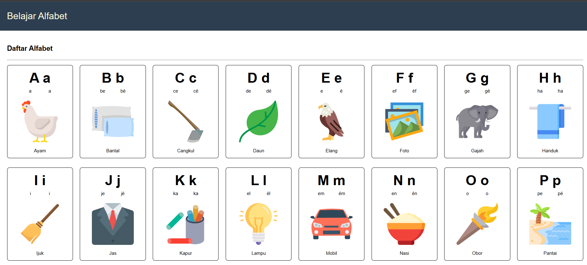
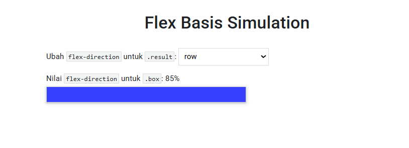

# 📚 Alphabet Learning & CSS Layout Simulation

This repository was developed as part of the Fundamental Front-End Web Development curriculum. It features two distinct tools: an educational application for learning the alphabet and a technical simulator for CSS Flexbox layouts.
# 🚀 Key Features

## 1. Alphabet Learning (index.html)

An interactive application designed to help beginners or children recognize letters through visual aids and word examples.

    Letter List: Clear display of uppercase and lowercase letters.

    Pronunciation Guide: Text-based guidance on how to pronounce each letter.

    Visual Examples: Paired with relevant images (e.g., Ayam for A, Bantal for B) to enhance memory retention.

    Responsive Design: Fully optimized for both mobile and desktop screens.

## **Preview:**

## 2. Flex Basis Simulation (Flex_Basis_Simulation.html)

A visual playground for web developers to understand how flex-basis and flex-direction properties interact within a CSS Flexbox container.

    Interactive Switcher: Change flex directions (row, column, etc.) in real-time.

    Live Feedback: Immediately see how the .box element responds to size and direction changes.

## **Preview:**

# 📁 Project Structure

.
├── screenshot/             # Application documentation images

├── src/                    # Assets and logic for Alphabet Learning

│   ├── images/             # Image assets (Chicken, Leaf, etc.)

│   ├── data.js             # Alphabet data source

│   ├── index.js            # Main Alphabet logic

│   └── styles.css          # Main styling

├── src_basis/              # Logic and styling for Flex Basis Simulator

│   ├── index.js

│   └── style.css

├── index.html              # Entry point for Alphabet Learning

└── Flex_Basis_Simulation.html # Entry point for CSS Simulator

# 🛠️ Technologies Used

    HTML5: Semantic structure for better accessibility.

    CSS3: Layouting using modern Flexbox and responsive design principles.

    JavaScript (Vanilla): DOM manipulation for data interactivity.

# 👤 Author

Developed by ranggautama47 as part of the Dicoding Indonesia learning path.